## 1. SLAM 개요

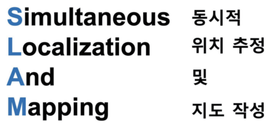

 image 1 

## 2. SLAM Algorithm

### - Bayes filter

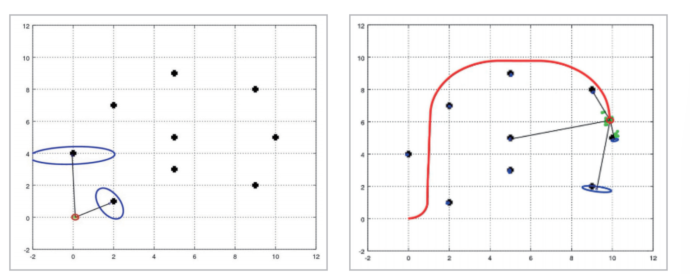

- 확률 기반의 재귀적인 필터
- 사전확률(Prior) and 가능도(Likelihood) -> 사후 확률(Posterior)을 계산
- ex) EKF SLAM(칼만 필터), FAST SLAM(파티클 필터)

### - Graph SLAM

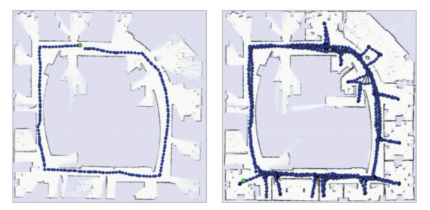

- Node(로봇의 위치) - Edge(두 노드 사이의 제약조건{회전과 이동}) 구조

### - Feature based method

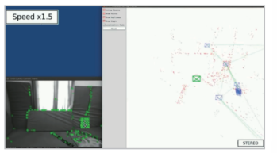

- 영상에서 특징점을 기반으로 카메라 궤적 추적 및 맵핑
- ex) ORB-SLAM

[https://www.youtube.com/watch?v=8DISRmsO2YQ](https://www.youtube.com/watch?v=8DISRmsO2YQ)

### - Direct method

- 영상간의 밝기 값 차이를 이용하여 카메라 궤적 추출 및 맵핑
- ex) LSD-SLAM

[https://www.youtube.com/watch?v=6KRlwqubLIU](https://www.youtube.com/watch?v=6KRlwqubLIU)

### - Deep learning (End-to-End)

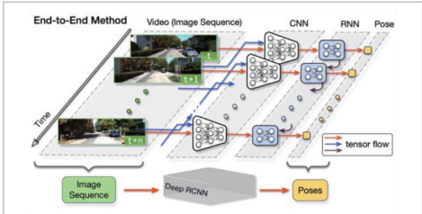

- 데이터 -> 패턴 및 정보 추출
- CNN(개별적인 영상에 대한 특징맵) -> RNN(연속적인 영상에 대한 특징 맵) -> pose
- ex) DeepVO

## 3. SLAM Algorithm pipline

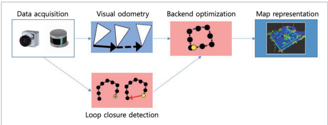

### - visual odometry

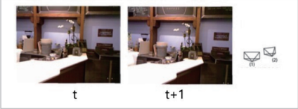

- 두 영상간의 특징점을 추출 및 대응관계 활용하여 상대적인 움직임 파라미터 계산

  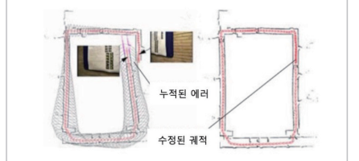

### - Loop closure detection

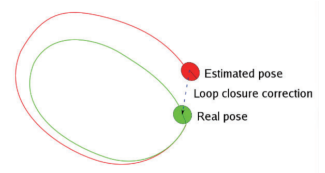

- 현재 센서의 위치가 이전에 방문한 곳인지 판단하는 알고리즘
- 현재 센서 입력과 이전 센서 입력사이의 유서성을 고려
- 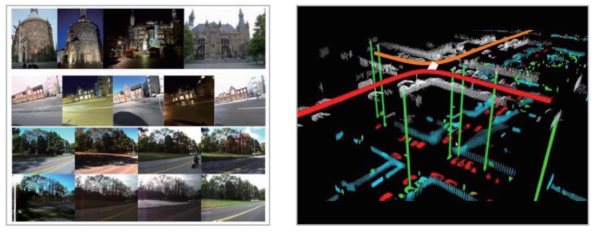

### - Bacend optimization

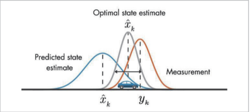

- 노이즈가 많은 데이터로부터 전체 시스템의 상태를 정확하게 추정
- 필터 기반 방법 : 베이즈 필터 - >재귀적으로 랜드마크 위치를 업데이트
- 비선형 기반 방법 : 비선형 모델에 의해 만들어지는 제약조건을 최소화 -> 랜드마크 업데이트

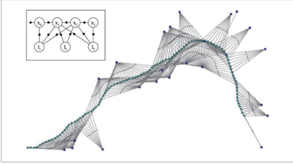

### - Map representation

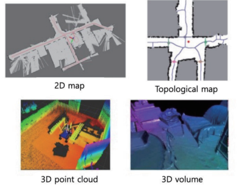

## 4. Mathematical definition of SLAM

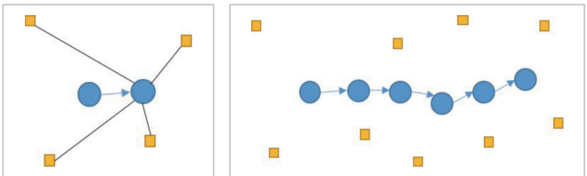

- T까지의 움직임 제어 정보 + 주변 환경 관찰 정보 -> 로봇 궤적에 대한 정보 + 지도정보

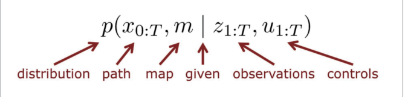

## 5. +

[https://www.youtube.com/watch?v=7SXDFQP5Gzc](https://www.youtube.com/watch?v=7SXDFQP5Gzc)

- Wheel Encoder : 모터의 회전량 측정
- IMU (가속도계 + 회전 속도계) -> 선형 가속도, 회전 가속도 (+ 자기장)
- GNSS + RTK-GPS

  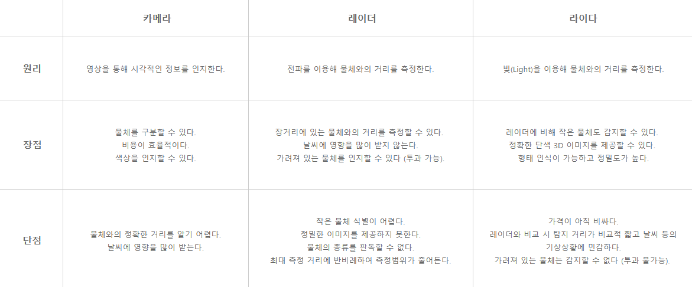
- 초음파 : 단거리
- Depth camera, RGB-D camera : 카메라 + 거리

## 6.

[https://vlmaps.github.io/](https://vlmaps.github.io/)
