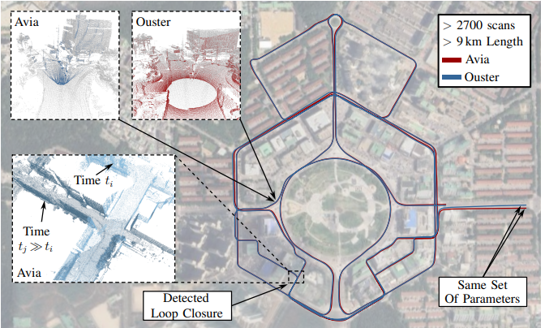

# Paper Study 3-3

영역 · 자원: Rokey BootCamp (https://www.notion.so/Rokey-BootCamp-1ad39aa2512b803ab013efcd70fb17d9?pvs=21)
고정하기: No
프로젝트: Rokey study 3-3 (https://www.notion.so/Rokey-study-3-3-1bb39aa2512b80148ed0c3594b835956?pvs=21)

# KISS-SLAM (2025.03.16)

### A Simple, Robust, and Accurate 3D LiDAR SLAM System With Enhanced Generalization Capabilities

- [https://arxiv.org/pdf/2503.12660](https://arxiv.org/pdf/2503.12660)
- [https://github.com/PRBonn/kiss-slam](https://github.com/PRBonn/kiss-slam)

### KISS : Keep It Small and Simple

---

- LiDAR-only SLAM not IMU, GNSS …  but high-performing
    - pose accuracy
    - map
    - real world possible
- Graph-based SLAM & LiDAR odometry
- match local maps → optimize the trajectory in a pose graph optimization step

## Our Approach to LiDAR-based SLAM

---

### LiDAR Odometry Using KISS_ICP

---

[https://arxiv.org/pdf/2209.15397](https://arxiv.org/pdf/2209.15397) 

- The LiDAR sensor in the odometry frame at time $t$,  : $T_t\in SE(3)$
- The incoming point cloud :  $P = \{p_i|p_i\in \R^3\}$
- The first pre-process by de-skewing and  voxel downsampling :  $S = \{s_i|s_i\in \R^3\}$

([https://velog.io/@se0yeon00/PointCloud-를-Voxel-grid-로-다운샘플링-하기](https://velog.io/@se0yeon00/PointCloud-%EB%A5%BC-Voxel-grid-%EB%A1%9C-%EB%8B%A4%EC%9A%B4%EC%83%98%ED%94%8C%EB%A7%81-%ED%95%98%EA%B8%B0))

- The previous estimate of the LiDAR pose :  $T_{t-1}$
- A constant velocity motion model prediction : $\triangle T_t \in SE(3)$
- An initial guess for the current LiDAR pose :

$$
\hat{T}_t = T_{t-1}\triangle T_t
$$

→ ICP algorithm : point-to-point Iterative Closet Point 

([https://alida.tistory.com/105](https://alida.tistory.com/105))([https://nbviewer.org/github/niosus/notebooks/blob/master/icp.ipynb#Non-linear-Least-squares-based-ICP](https://nbviewer.org/github/niosus/notebooks/blob/master/icp.ipynb#Non-linear-Least-squares-based-ICP)**)**

- The local map points  : $\varphi = \{q_i|q_i\in \R^3\}$
- residual : $r$,

$$
r(T)=Ts-q
$$

- cost function : ( c : The set of nearest neighbor correspondenecs)

$$
\chi(\hat{T_t}=\sum_{(s,q)\in c}\left\|r(\hat{T_t})\right\|_2^2
$$

- minimize EQ (least squares fashion) :

$$
\triangle w=\underset{\triangle w}{argmin} \chi (\hat{T_t} \bigoplus \triangle w), \ \ \triangle w \in \R^6
$$

### Local Mapping and Pose Graph Construction

---

→ approach avoids main training a single global map through a local map-splitting strategy.

- Local map : $M_k$
- Keypose : $T_k \in SE(3)$
- local trajectory : $\tau_k\in\{T_{t->t+1}|t_s\leq t < t_e\}$
- voxel grid : $\nu_k$

→ Create a new local map when the traveled distance exceeds a certain threshold $\beta$

### Loop Closing

---

<Gupta te al>

https://arxiv.org/pdf/2501.07399

- Ground Alignment → x-y-plane of the keypose reference frame
- BEV Density Image
- ORB Feature Descriptors
- the SzymkiewiczSimson overlap coefficient: → 2D alignment of the density images
    - compute mean of the point  coordinates $u_i$ and a per-voxel normal vector $n_i$
    - → $N_k = \{\{u_i,n_i\}|u_i, n_i\in \R^3\}$ (resulting point cloud)
    - apply the initial guess $\hat{T}_{i->j}$ & perfom a point cloud registration step between the voxel-based point clouds $N_i, N_j$

$$
\Gamma (N_i,N_j, T_{i->j})=\frac{|N_j\cap T_{i->j}\oplus N_i|}{min(|N_j|,|N_i|)}
$$

